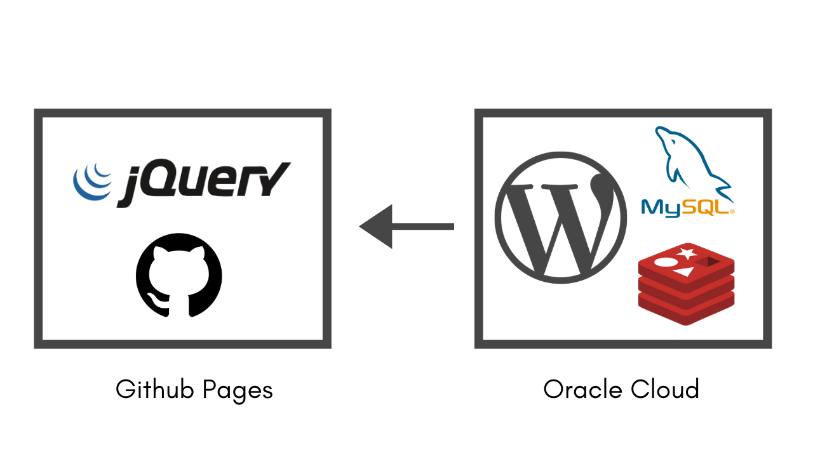

# My Website

I finally managed to setup a proper website for myself &#128513; Here is how the website is setup - 

Website is written in plain and simple HTML, CSS & JQuery (Not React/Angular/Vue) hosted on Github Pages &#128522; 

The Blog section uses Wordpress as a REST backend which is hosted in Oracle Cloud . I am using WP Fastest Cache and Redis & OpCache to speed things up.

(Secret: you can get 2 basic VM (1 CPU, 2 Threads, 1 GB RAM, 50 GB SSD) for free on Oracle cloud) 